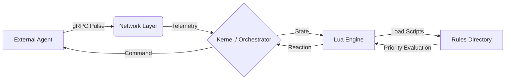

# Open Cardinal 🛡️

Authorship Notice

This project is fully original and authorial, designed and implemented exclusively by **Guilherme Bento ( Poluxin21 )**.
All architectural decisions, core concepts, and implementations are the result of independent work.

**This project aims to contribute to the software development community.**

--- 


**Open Cardinal** is a high-performance, deterministic sentinel system designed for critical infrastructure monitoring and automated decision-making.

It acts as a **generic middleware sidecar**, connecting diverse agents (Game Servers, IoT Arrays, Aerospace Telemetry) to a centralized, **hot-swappable logic engine powered by Lua**.

> Designed to be the immune system for your infrastructure: it doesn't just alert — **it acts**.

---

## 🏗 Architecture

Cardinal implements a strict **Kernel–Engine–Network** separation of concerns to ensure stability under load.



### Core Components

* **Kernel (Rust / Tokio)**
  Handles async I/O, resource management, and thread scheduling.

* **Network (gRPC / Tonic)**
  Provides a strictly typed contract (Protobuf) for high-throughput, low-latency communication.

* **Engine (mlua)**
  A sandboxed Lua 5.4 virtual machine that safely executes user-defined logic.

---

## 🚀 Key Features

* ⚡ **Zero-Cost Abstractions**
  Built on Rust’s async ecosystem, designed to handle thousands of concurrent agents with minimal memory footprint (<10MB idle).

* 🧠 **Hot-Swappable Logic**
  Update business rules dynamically without recompiling or restarting the kernel — ideal for 24/7 systems.

* 🛡️ **Sandboxed Execution**
  User scripts run in an isolated environment (mlua), preventing faulty logic from crashing the host process.

* 🔌 **Protocol Agnostic**
  Optimized for gRPC, but designed to support future adapters (WebSockets, IPC).

* 🎯 **Priority-Based Decision Engine**
  Multiple scripts are evaluated simultaneously; the reaction with the highest priority weight wins.

---

## 🛠️ Tech Stack

| Component | Technology          | Reasoning                                                |
| --------- | ------------------- | -------------------------------------------------------- |
| Core      | Rust (Tokio, Tonic) | Memory safety without garbage collection pauses          |
| Scripting | Lua 5.4 (via mlua)  | Industry standard for embedded logic (Redis, Nginx, WoW) |
| Protocol  | Protobuf (Prost)    | Schema-first design ensures strict service contracts     |

---

## 🧠 The “Brain”: Defining Rules

Cardinal uses a **file-based priority system**.
Simply drop a `.lua` file into:

```
rules/<agent_id>/
```

### Example

**Path:** `rules/rocket_01/safety.lua`

```lua
-- The 'pulse' object is injected automatically by the Rust Kernel
local fuel = tonumber(pulse.telemetry["fuel"]) or 0
local alt = tonumber(pulse.telemetry["altitude"]) or 0

-- Rule: If fuel is critical and altitude is high, force landing.
if fuel < 5 and alt > 1000 then
    return {
        action = "CUSTOM",
        cmd_name = "EMERGENCY_LANDING",
        priority = 100, -- High priority overrides default behaviors
        params = {
            ["gear"] = "down",
            ["beacon"] = "on"
        }
    }
end

-- Default fallback
return { action = "IDLE", priority = 0 }
```

---

## 📦 Installation & Usage

### Prerequisites

* Rust (`cargo`)
* Protobuf Compiler (`protoc`) [https://github.com/protocolbuffers/protobuf]
* Lua: [https://www.lua.org/download.html]

---

### 1. Build from Source

```bash
git clone https://github.com/Poluxin21/open-cardinal.git
cd open-cardinal
cargo build --release
```

---

### 2. Run the Sentinel Server

```bash
./target/release/open-cardinal
```

**Output:**

```text
🚀 Cardinal gRPC Server listening on [::1]:50051
```

---

### 3. Simulate an Agent (CLI)

```bash
cargo run --bin client -- simulate --id "Rocket_01" --interval 500
```

---

## 🗺️ Roadmap

* [x] Core gRPC Server & Client
* [x] Lua Engine Integration (mlua)
* [x] Hot-Reload Strategy (File Watcher)
* [ ] Distributed Tracing (OpenTelemetry)
* [ ] Docker / Kubernetes Sidecar Support
* [ ] Web Dashboard (WASM)

---

## 🤝 Contributing

Contributions are welcome!

---

## 📜 License

Distributed under the **MIT License**.
See `LICENSE` for more information.

---

Built with 🦀 in **Rust**.
